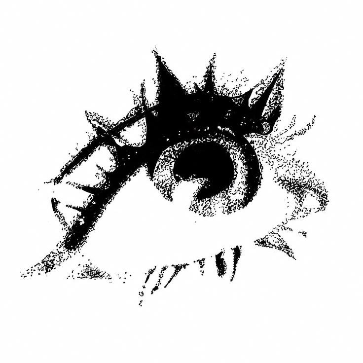

<p align="center">
  
</p>

<h1 align="center">SyndromeOS</h1>

<p align="center">
  A 64-bit x86_64 operating system built from scratch.
</p>

---

## About

**SyndromeOS** is a personal OS development project focused on low-level systems programming, UEFI boot, kernel development, memory management, graphics, and computer architecture.

The goal is to build the system from the ground up and eventually run custom applications and a graphics renderer directly on the OS.

## Current Progress

- UEFI bootloader
- x86_64 architecture
- GNU-EFI toolchain
- Dockerized build environment
- CMake build system
- FAT32 bootable disk image
- QEMU + OVMF testing
- VS Code Dev Container

## Tech Stack

`C` · `C++` · `Assembly` · `Rust` · `CMake` · `Docker` · `QEMU` · `UEFI`

## Build & Run

From PowerShell:

```powershell
.\tools\run.ps1