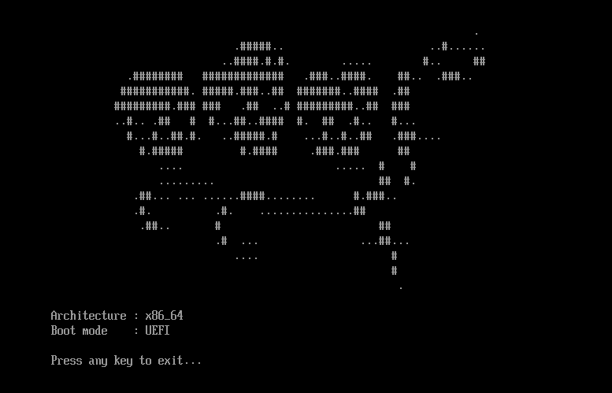

<p align="center">
  
</p>

<h1 align="center">SyndromeOS</h1>

<p align="center">
  <i>A 64-bit x86_64 operating system built from scratch.</i>
</p>

<p align="center">
  <code>C</code> · <code>C++</code> · <code>Assembly</code> · <code>Rust</code> · <code>UEFI</code> · <code>CMake</code> · <code>QEMU</code>
</p>

<br>

<p align="center">
  <b>Low-level systems. Computer architecture. Graphics.</b>
</p>

<br>

<p align="center">
  
</p>

<p align="center">
  <i>SyndromeOS booting through UEFI on x86_64.</i>
</p>

---

## About

**SyndromeOS** is a personal operating system development project focused on low-level systems programming, UEFI boot, kernel development, memory management, graphics, and computer architecture.

The goal is to build the system from the ground up and eventually run custom applications and a graphics renderer directly on the OS.

<br>

## Tech Stack

**Languages:**  

`C` · `C++` · `Assembly` · `Rust`

**Systems & Tools:**  

`UEFI` · `CMake` · `Docker` · `QEMU` · `OVMF`

<br>

## Build & Run

From PowerShell:

```powershell
.\tools\run.ps1